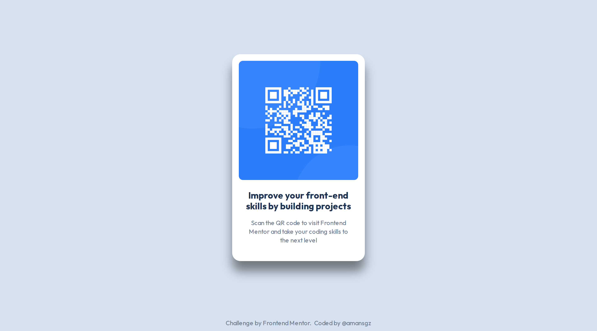

# Frontend Mentor | QR code component solution

This is a solution to the [QR code component challenge on Frontend Mentor](https://www.frontendmentor.io/challenges/qr-code-component-iux_sIO_H), part of [Getting started on Frontend Mentor](https://www.frontendmentor.io/learning-paths/getting-started-on-frontend-mentor-XJhRWRREZd) learning path.

## Table of contents

- [Overview](#overview)
  - [The challenge](#the-challenge)
  - [Screenshots](#screenshots)
  - [Links](#links)
- [My process](#my-process)
  - [Built with](#built-with)
  - [Project Structure](#project-structure)
  - [What I learned](#what-i-learned)
    - [Semantic HTML Structure](#semantic-html-structure)
    - [CSS styles](#css-styles)
- [Author](#author)

## Overview

### The challenge

The challenge was to build out this QR code component and get it as close as possible to the original design.

### Screenshot



### Links

- Solution URL: [https://www.frontendmentor.io/solutions/card-component-built-with-css-custom-properties-krZg583OIP](https://www.frontendmentor.io/solutions/card-component-built-with-css-custom-properties-krZg583OIP)

- Live Site URL: [https://amansgz.github.io/fm-learning-paths/qr-code-component/index.html](https://amansgz.github.io/fm-learning-paths/qr-code-component/index.html)

## My process

### Built with

- Semantic HTML5 markup
- BEM Methodology
- CSS custom properties
- Flexbox
- Mobile-first workflow
- Figma design

### Project Structure

```
qr-code-component/
|
|--- .gitignore
|--- README.md
|--- index.html
|--- CSS/
|    |--- base.css
|    |--- main.css
|    |--- tokens.css
|    |--- layout.css
|    |--- components/
|         |--- card.css
|         |--- attribution.css
|--- IMAGES/
|--- SCREENSHOTS/ (mobile, tablet and desktop versions)
|--- DESIGN/
```

### What I learned

#### Semantic HTML Structure

The component uses a single-component architecture with the `article` element, which represents a self-contained, independent composition.

```html
<article>
  
  <h1>Improve your front-end skills by building projects</h1>
  <p>
    Scan the QR code to visit Frontend Mentor and take your coding skills to the
    next level
  </p>
</article>
```

#### CSS styles

Implemented a design system based on the Figma design and style guide, featuring:

- **CSS custom properties** for colors, font styles and elements spacing
- **Logical properties** for improved layout flexibility
- **rem units** for consistent and responsive scaling

## Author

- Frontend Mentor - [@amansgz](https://www.frontendmentor.io/profile/amansgz)
- Github - [@amansgz](https://github.com/amansgz)
